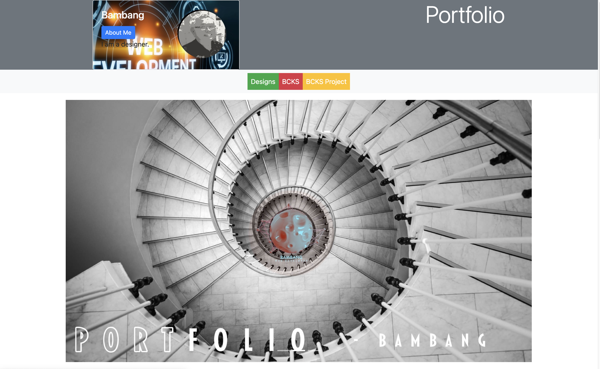
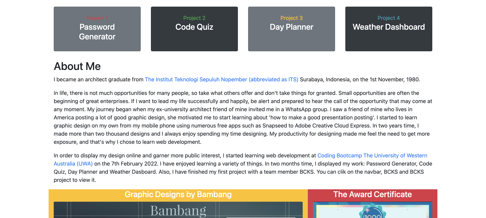
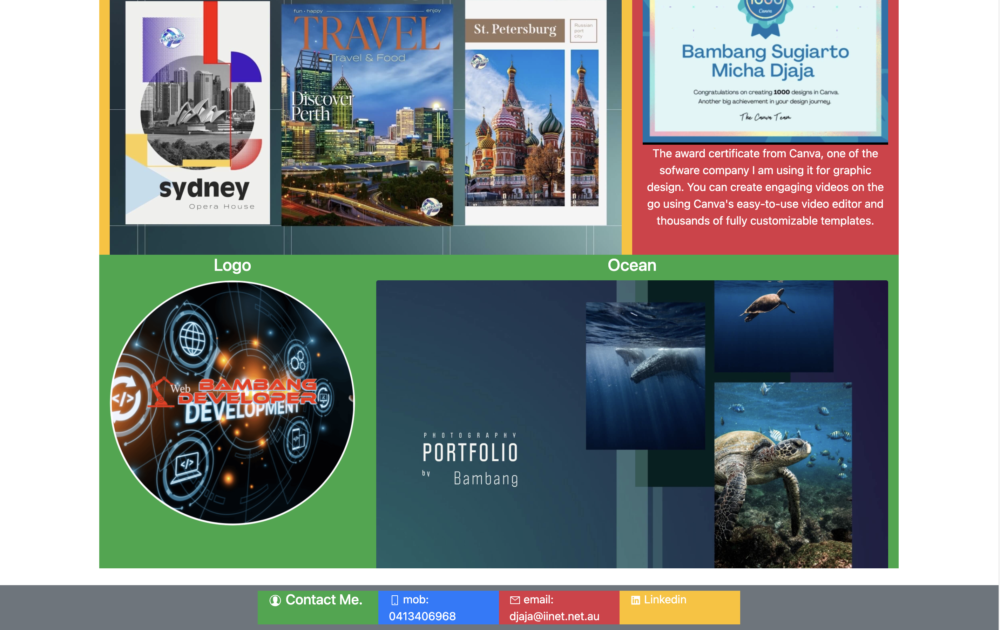
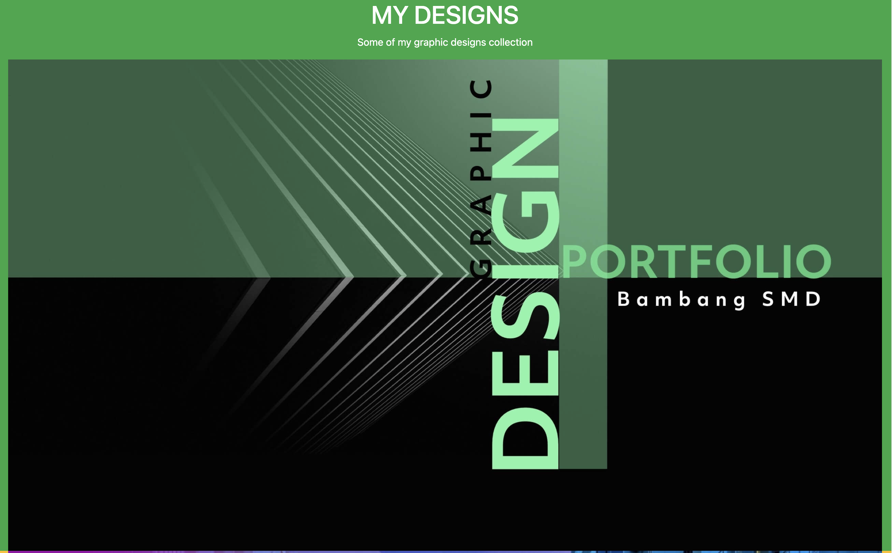

# Updated-Portfolio-Page

## Description
This Portfolio, I have made an updated a lot of things. I display all my works, Password Generator, Code Quiz, Day Planner, Weather Dashboard, BCKS project and my graphic designs. I am using Bootstrap 4 to create my Portfolio Page. For the first page all the codes in index.html and for the second page all the codes in design.html. For the responsiveness in CSS I make the image fully responsive. In the header I create class: jumbotron fluid, background- secondary, d-flex and justify-content-around. I put the card and my cartoon image inside the header. I turn my image into a card background and use .card-img-overlay to add text on top of the image. In navbar, I created three link, Designs, BCKS and BCKS project. I use Bootstrap 4 carousel to create a slideshow for cycling through elements to display my three graphic designs. About me section, I added my background as an architect with the link can go through website of the University "ITS", and I am studying Coding with the link can go through website Coding Bootcamp "UWA". I use a Bootstrap 4 Grid .row .col-12 for About Me, for the four image .row .col-8, col-4, col-4, col-8. For the bottom I made .container fluid navbar navbar-expand-sm bg-secondary justify-content-center class: row col-sm-3. I use icon from React icons. Similarly in design.html I use a Bootstrap 4 Grid.

## Demo

## Link to Website

https://b-smd.github.io/Updated-Portfolio-Page/

https://github.com/B-smd/Updated-Portfolio-Page.git

https://b-smd.github.io/Password-Generator/

https://b-smd.github.io/codequiz/

https://b-smd.github.io/Day-Planner/

https://b-smd.github.io/Weather-Dashboard-2/

https://docs.google.com/presentation/d/1eVebT4IO4JAvaRzri6gZOe0RG_T9iABlIQI8fgy2x3Y/edit?usp=sharing

https://b-smd.github.io/BCKS-Project/

https://www.its.ac.id/arsitektur/

https://bootcamp.uwa.edu.au/coding/landing/?s=Google-Brand&pkw=%2Buwa%20%2Bcoding%20%2Bbootcamp&pcrid=494735218547&pmt=b&utm_source=google&utm_medium=cpc&utm_campaign=GGL%7CUNIVERSITY-OF-WESTERN-AUSTRALIA%7CSEM%7CCODING%7C-%7COFL%7CTIER-1%7CALL%7CBRD%7CBMM%7CCore%7CBootcamp&utm_term=%2Buwa%20%2Bcoding%20%2Bbootcamp&utm_content=494735218547&s=google&k=%2Buwa%20%2Bcoding%20%2Bbootcamp&gclid=CjwKCAjw3cSSBhBGEiwAVII0Z7i4MwLRSfnZiPRkIRS62Z55kXvEEoQsj8i3LO-iiNGi4mbaHy-0HhoCOJAQAvD_BwE&gclsrc=aw.ds

## Technologies Used
- HTML
- CSS
- Bootstrap 4

## Usage
All my works and graphic designs I display in the first page, in the carousel there is a slide show for cycling through elements, you can view my three graphic designs, on the second page I display more of my graphic designs collection. If you interesting about me, you can click about me button on the header and will go through about me section. There are two link inside about me first go through "The Institut Teknologi Sepuluh Nopember (ITS)" Surabaya, Indonesia website, and second go through "Coding Bootcamp The University of Western Australia (UWA)" website.  If you click Designs on the navbar will open the second page and after you view all the page you can click back to the home page. When you click a link BCKS, it will go through to the BCKS presentation and when you click BCKS project link, it will go through to the BCKS Project page in github. When you click my works in project 1,2,3,4 will go through github page: Pasword Generator, Code Quiz, Day Planner and Weather Dashboard. 

## Contributing
Pull request are welcome, you can make a constribution at the bottom of any docs page to make small changes such as a typo, sentence fix or a broken link. For major changes, please open an issue first to discuss what you would like to change.

## Licence
[MIT]
(http)://choosealicence.com/licences/mit/)
